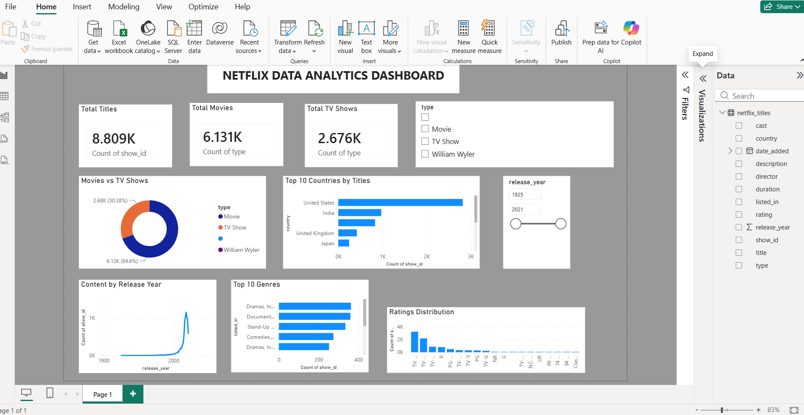

# Netflix Data Analysis 📊

## Project Overview

This project analyzes Netflix Movies and TV Shows data to identify trends and insights related to content type, countries, release years, ratings, genres, and directors.

The project was developed using **Python for data analysis** and **Power BI for interactive dashboard visualization**.

## Tools & Technologies

* Python
* Pandas
* NumPy
* Matplotlib
* Jupyter Notebook
* Power BI
* GitHub

## Dataset

The dataset contains information about Netflix Movies and TV Shows, including:

* Show ID
* Title
* Content Type
* Director
* Cast
* Country
* Date Added
* Release Year
* Rating
* Duration
* Genre
* Description

## Data Analysis

The following analysis was performed using Python:

* Movies vs TV Shows analysis
* Top 10 countries by number of titles
* Netflix content by release year
* Ratings distribution
* Top directors
* Movie duration analysis
* Top 10 genres
* Missing value and duplicate data handling

## Power BI Dashboard

An interactive Power BI dashboard was created to visualize:

* Total Titles
* Total Movies
* Total TV Shows
* Movies vs TV Shows
* Top 10 Countries
* Content by Release Year
* Top 10 Genres
* Ratings Distribution
* Type and Release Year filters

## Key Insights

* Movies represent a larger share of Netflix content than TV Shows.
* The United States has one of the highest numbers of Netflix titles.
* Netflix content increased significantly over the years.
* TV-MA is among the most common content ratings.
* Drama and international content are among the major content categories.

## Project Structure

```text
Netflix-Data-Analysis/
│
├── Netflix_Data_Analysis.ipynb
├── Netflix_Dashboard.png
└── README.md
```

## Dashboard Preview



## Conclusion

This project demonstrates the use of Python for data cleaning and exploratory data analysis, along with Power BI for creating an interactive and visually appealing dashboard.

The analysis provides insights into Netflix's content distribution and helps understand trends across countries, years, genres, and ratings.
